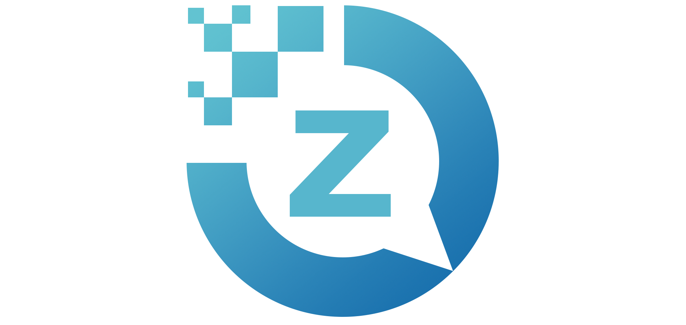

# zhamao-framework

一个异步、多平台兼容的 **聊天机器人** 框架。

 

## 简介
zhamao-framework 是一个基于 酷Q 的 PHP 机器人框架，它会对 QQ 机器人收到的消息进行解析处理，并以模块化的形式进行开发，来完成机器人的自然语言对话等功能。

除了起到解析消息的作用，炸毛框架 还提供了完整的 WebSocket + HTTP 服务器，你还能用此框架构建出高性能的 API 接口服务器。

## 文档
本项目文档正在努力编写中：[https://framework.zhamao.xin/](https://framework.zhamao.xin/)

## 特点
- 支持多账号
- 灵活的注解事件绑定机制
- 采用模块化编写，功能之间高内聚低耦合
- 常驻内存，全局缓存变量随处使用
- 自带 MySQL 查询器、数据库连接池等数据库连接方案
- 自带 HTTP 服务器、WebSocket 服务器可复用，可以构建属于自己的 HTTP API 接口

## 从 cqbot-swoole 升级
目前新的框架采用了全新的注解机制，所以旧版的框架上写的模块到新框架需要重新编写。当然为了减少工作量，新的框架也最大限度地保留了旧版框架编写的风格，一般情况下根据新版框架的文档仅需修改少量地方即可完成重写。

旧版框架并入了 `old` 分支，如果想继续使用旧版框架请移步分支。升级过程中如果遇到问题可以找作者。

## 贡献
如果你在使用过程中发现任何问题，可以提交 Issue 或自行 Fork 后修改并提交 Pull Request。目前项目仅一人维护，耗费精力较大，所以非常欢迎对框架的贡献。

## 关于
框架和 SDK 是 炸毛机器人 项目的核心框架开源部分。炸毛机器人（3276124472）是作者写的一个高性能机器人，曾获全国计算机设计大赛一等奖。

欢迎随时在 HTTP-API 插件群里提问，当然更好的话可以加作者 QQ（627577391）或提交 Issue 进行疑难解答。

本项目在更行内容时，请及时关注 GitHub 动态，更新前请将自己的模块代码做好备份。